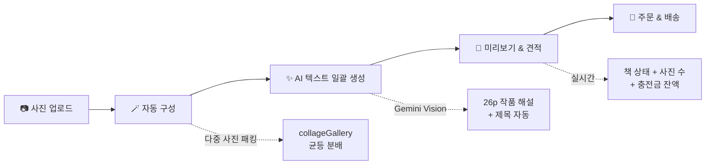
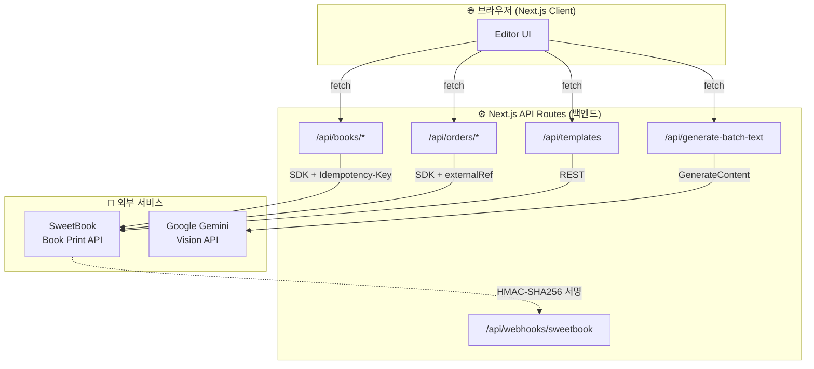

# KidCanvas — 우리 아이 그림 작품집

> 아이가 그린 세상을 한 권의 프리미엄 하드커버 작품집으로.

**KidCanvas**는 SweetBook Book Print API 기반의 아이 그림 작품집 제작 에디터입니다.
부모가 아이의 그림 사진을 업로드하면 AI가 미술관 큐레이터 스타일의 작품 해설을 자동 생성하고, 미술관 도록 스타일의 하드커버 포토북으로 제작·배송합니다.

**타겟 고객**: 3~10세 자녀를 둔 부모, 어린이집/유치원 (B2B 단체 주문)

---

## 미리보기 — Gemini 생성 더미 작품집

> 실행 직후 `샘플 채우기` 버튼 한 번으로 아래 28장의 AI 생성 작품과 큐레이터 스타일 해설이 자동 입력됩니다.

<table>
  <tr>
    <td align="center"><b>앞표지</b><br/></td>
    <td align="center"><b>색깔 회오리</b><br/></td>
    <td align="center"><b>두부와 의자</b><br/></td>
    <td align="center"><b>가족의 정원</b><br/></td>
    <td align="center"><b>뒤표지</b><br/></td>
  </tr>
</table>

---

## 사용자 워크플로우



## 시스템 아키텍처



> **핵심 보안 원칙**: 브라우저는 SweetBook API에 직접 호출하지 않습니다. API Key는 서버 측 환경변수(`process.env.SWEETBOOK_API_KEY`)에서만 읽히며, 모든 SweetBook 호출은 Next.js API Routes를 통한 프록시로 일원화됩니다.

---

## 핵심 기술 성과

### 1. Idempotency-Safe 트랜잭션 파이프라인
- `crypto.randomUUID()` 기반 `Idempotency-Key` 헤더 자동 주입
- 409 Conflict 안전 처리 — 네트워크 재시도 시 중복 주문/책 생성 원천 차단
- 5xx 에러 3회 자동 재시도 + 지수 백오프 (`fetchWithRetry`)

### 2. breakBefore 기반 동적 레이아웃 페이지 렌더링
- SweetBook Dynamic Layout 엔진의 `breakBefore` 속성을 템플릿 메타데이터에서 동적 해석
- `'page'` (독립 페이지) vs `'none'` (연속 플로우) — 갤러리/일기장/포토북 템플릿별 최적 배치
- 안전 기본값 `'page'`로 전환하여 전 카테고리 finalize 100% 성공

### 3. 유령 템플릿 차단 아키텍처 (3-Layer Defense)
- **Layer 1**: `categoryToTplMap` 글로벌 상수 폴백 완전 제거 — 현재 카테고리 스코프 내 UID만 허용
- **Layer 2**: 카테고리 변경 시 `validUids` Set 교차검증 → 갤러리 아이템의 stale templateUid 즉시 null 초기화
- **Layer 3**: `handleCreateBook` 내지 전송 루프에서 `validUids.has()` 최종 게이트키핑

### 4. Decorative File Binding 분리
- 템플릿 `parameters.definitions`의 `file` 바인딩을 사용자 사진 vs 장식용 에셋으로 정밀 분류
- `DECORATIVE_FILE_KEYS` Set — 장식 파일에는 투명 placeholder 자동 주입
- 전 카테고리(일기장A/B, 알림장A/B/C, 구글포토북A/B/C) API 100% 호환 달성

### 5. Auto Compose — 이미지 기반 자동 페이지 구성
- 갤러리에 이미지 업로드 후 **AUTO COMPOSE** 버튼 클릭 → 자동 페이지 배치
- 첫 장 → 앞표지, 마지막 → 뒤표지, 나머지 → 내지 순서 자동 배정
- 목표 페이지 수 설정 (24~130p, 2 단위)
- **사진 수 적응형 3-Case 배치 로직**
  - **Case A (사진 ≤ 목표)**: 1장/페이지 + 부족분 빈 슬롯 자동 패딩 (미술관 도록 1작품 1페이지 원칙)
  - **Case B (사진 > 목표)**: 현재 카테고리의 다중 사진 템플릿(`collageGallery` 우선, `rowGallery` 폴백)을 자동 탐색 → `Math.ceil(remaining/pagesLeft)` 균등 분배로 한 페이지에 여러 장 패킹 → 목표 페이지 수 정확히 맞춤
  - **Case C (다중 템플릿 없음/용량 초과)**: 1장/페이지 폴백 + 경고 토스트
- **표지/내지 레이아웃 하이브리드 선택**: 카테고리만 고르고 레이아웃을 비워 두면 `catGroup.covers[0]` + `catGroup.withPhoto[0]`이 자동 적용. 사용자가 표지 레이아웃을 직접 고르면 `validUids` Set 검증을 통과한 경우에만 우선 적용 (카테고리 외부 유령 UID 자동 차단)

### 6. AI 작품 해설 생성 — Gemini Vision 기반 큐레이터 스타일
- **AI 텍스트 일괄 생성**: 갤러리의 모든 내지 이미지를 Gemini Vision으로 분석 → 26페이지 작품 해설 + 제목 자동 생성
- 5장씩 배치 전송 (payload 크기 제한 대응) → 6배치 순차 처리 → 전체 결과 병합
- 각 그림의 색감, 구도, 표현 기법, 주제를 관찰하고 미술관 도록 스타일로 해석
- **개별 AI TEXT**: 페이지별 개별 생성도 가능 (편집 패널 AI TEXT 버튼)
- 모델: `gemini-2.5-flash` (Vision 지원) → 배치별 폴백 텍스트

### 7. API 검증 파이프라인 — 업로드/최종화/미리보기 3단 검증
- 사진 업로드 완료 후 `GET /books/{bookUid}/photos` 호출 → 서버 등록 수량 vs 로컬 전송 수량 교차검증
- 최종화 완료 후 `GET /books` (목록 조회 + UID 필터링) → 실제 책 상태(status), 페이지 수, 판형 확인
- `GET /books/{bookUid}` 단건 API 405 대응 — `listBooks()` 우회 전략 + 프론트엔드 에러 폴백
- 미리보기 페이지에서 3개 API 병렬 호출 → 책 상태 배지 + 업로드 사진 수 + 충전금 잔액 실시간 표시
- API 로그에 검증 결과 실시간 표시 — 누락 사진 조기 감지

### 8. Webhook 주문 상태 실시간 추적
- SweetBook 서버 → `POST /api/webhooks/sweetbook` — 주문 상태 변경 이벤트 수신
- **HMAC-SHA256 서명 검증** + 중복 방지
- **ngrok 연동** + **로컬 시뮬레이터** 지원

---

## 실행 방법

### 사전 준비
- **Node.js** 18.0+
- **npm** 9.0+
- **SweetBook Sandbox API Key** ([api.sweetbook.com](https://api.sweetbook.com))

### 설치 및 실행

```bash
git clone https://github.com/Thingjae98/bookmaker.git
cd bookmaker
npm install

cp .env.example .env
# .env 파일을 열고 API Key 입력:
#   SWEETBOOK_API_KEY=your_sandbox_api_key_here
#   SWEETBOOK_API_BASE_URL=https://api-sandbox.sweetbook.com/v1

npm run dev
```

`http://localhost:3000` 접속 후 서비스를 확인할 수 있습니다.

### 시연 순서 (로컬 영상 녹화용)
1. 메인 페이지 → **"작품집 만들기"**
2. **"샘플 채우기"** → 아이 그림 작품집 샘플 자동 입력
3. **"다음: 꾸미기"** → 에디터 진입
4. 갤러리 Drag & Drop 존에 아이 그림 사진 업로드
5. **"AI 텍스트 일괄 생성"** → Gemini Vision이 26장 이미지 분석 → 작품 해설 + 제목 자동 생성
6. 썸네일 클릭 → 인라인 편집 패널에서 확인/수정 (개별 **AI TEXT** 버튼도 사용 가능)
7. **"책 생성 & 최종화"** → API 로그 실시간 확인
8. **"다음: 미리보기 & 주문"** → 스프레드 뷰 확인
9. **"다음: 주문하기"** → 배송지 입력 → 주문 생성
10. **"주문 내역"**에서 상태 추적

---

## 사용한 API

| API | 메서드 | 엔드포인트 | 용도 |
|-----|--------|-----------|------|
| Books | `POST` | `/v1/books` | 책 생성 (draft) |
| Books | `GET` | `/v1/books` | 책 목록 조회 (단건 조회 우회 — `GET /books/{uid}` 405 대응) |
| Books | `POST` | `/v1/books/{bookUid}/photos` | 사진 업로드 (multipart) |
| Books | `GET` | `/v1/books/{bookUid}/photos` | 사진 목록 조회 (업로드 검증) |
| Books | `POST` | `/v1/books/{bookUid}/cover` | 표지 추가 |
| Books | `POST` | `/v1/books/{bookUid}/contents` | 내지 페이지 추가 |
| Books | `POST` | `/v1/books/{bookUid}/finalization` | 최종화 |
| Orders | `POST` | `/v1/orders/estimate` | 가격 견적 |
| Orders | `POST` | `/v1/orders` | 주문 생성 |
| Orders | `GET` | `/v1/orders` | 주문 목록 |
| Orders | `GET` | `/v1/orders/{orderUid}` | 주문 상세 |
| Orders | `POST` | `/v1/orders/{orderUid}/cancel` | 주문 취소 |
| Orders | `PATCH` | `/v1/orders/{orderUid}/shipping` | 배송지 변경 |
| Templates | `GET` | `/v1/templates` | 템플릿 목록 |
| Templates | `GET` | `/v1/templates/{templateUid}` | 템플릿 상세 |
| BookSpecs | `GET` | `/v1/book-specs` | 판형 목록 |
| Credits | `GET` | `/v1/credits` | 충전금 잔액 |
| Webhooks | `PUT` | `/v1/webhooks/config` | Webhook URL 등록/수정 |
| Webhooks | `POST` | `/v1/webhooks/test` | 테스트 이벤트 전송 |
| Webhooks | `POST` | `/api/webhooks/sweetbook` | 주문 상태 이벤트 수신 |

---

## AI 도구 사용 내역

| AI 도구 | 활용 내용 |
|---------|----------|
| Claude (Anthropic) | 프로젝트 아키텍처 설계, 프론트엔드/백엔드 코드 작성, API 연동 |
| Claude (Anthropic) | SweetBook API 문서 분석, 트러블슈팅 (breakBefore, Decorative File) |
| Claude (Anthropic) | README, DECISION_LOG, CLAUDE.md 작성, 서비스 기획 |
| Gemini (Google) | 에디터 내 아이 그림 작품 해설 텍스트 AI 자동 생성 |
| Gemini (Google) | 더미 데이터용 아이 그림 이미지 28장 AI 생성 |

---

## 설계 의도

### 왜 "KidCanvas"인가
Book Print API의 본질은 **디지털→물리적 변환**입니다. 아이가 그린 그림은 시간이 지나면 잊혀지거나 버려지지만, 부모에게는 가장 소중한 작품입니다. KidCanvas는 이 순간을 미술관 도록 스타일의 프리미엄 하드커버 작품집으로 영구 보존합니다.

### 디자인 철학: Warm & Playful
- **Typography**: Nanum Pen Script (손글씨 느낌 헤딩) + Noto Sans KR (본문)
- **Palette**: peach/butter/mint/sky/lavender 파스텔 톤, 따뜻하고 부드러운 UI
- **Layout**: 둥근 모서리(rounded-2xl), 부드러운 그림자, 귀여운 이모지 아이콘

### 비즈니스 확장 가능성
- **B2C**: 부모가 자녀 그림 → 작품집 제작 (생일, 졸업, 크리스마스 선물)
- **B2B**: 어린이집/유치원 연간 계약 → 학기별 작품집 단체 제작
- **프리미엄**: AI Vision으로 아이 그림 자동 분석 → 화풍/색감/발달 단계 해설
- **구독 모델**: 월/분기 정기 작품집 제작 서비스

---

## 기술 스택

| 영역 | 기술 |
|------|------|
| 프레임워크 | Next.js 14 (App Router) |
| 프론트엔드 | React 18, Tailwind CSS |
| AI 텍스트 | Google Gemini API (@google/generative-ai) |
| 백엔드 | Next.js API Routes |
| API 클라이언트 | bookprintapi-nodejs-sdk |
| 파일 업로드 | HTML5 File API + Drag & Drop + FormData |
| 이미지 전처리 | sharp (이미지 → 판형 비율 리사이징) |
| 폰트 | Nanum Pen Script, Noto Sans KR |

### 프로젝트 구조

```
bookmaker/
├── src/
│   ├── app/
│   │   ├── page.jsx                          # 랜딩 페이지
│   │   ├── create/[serviceType]/page.jsx     # 작품집 정보 입력
│   │   ├── editor/page.jsx                   # 콘텐츠 에디터 (핵심)
│   │   ├── preview/page.jsx                  # 미리보기 & 견적
│   │   ├── order/page.jsx                    # 주문 (배송지 입력)
│   │   ├── orders/page.jsx                   # 주문 내역
│   │   └── api/                              # 백엔드 API 프록시
│   │       ├── books/                        #   Books API
│   │       ├── orders/                       #   Orders API
│   │       ├── templates/                    #   Templates API
│   │       ├── book-specs/                   #   BookSpecs API
│   │       ├── credits/                      #   Credits API
│   │       ├── generate-page-text/           #   AI 작품 해설 개별 생성 (Gemini)
│   │       ├── generate-batch-text/         #   AI 작품 해설 일괄 생성 (Gemini Vision)
│   │       └── webhooks/sweetbook/           #   Webhook 수신
│   ├── components/                           # UI 컴포넌트
│   ├── lib/                                  # 유틸리티 (sweetbook.js, fetchWithRetry)
│   └── data/dummy.js                         # 아이 그림 작품집 더미 데이터 (26p, Gemini 생성)
├── public/images/kidcanvas/                  # Gemini 생성 아이 그림 이미지 28장
└── .env.example                              # 환경변수 템플릿
```

---

## SweetBook API 스펙 대응

### 완전 구현
- **Books API** — 생성 → 사진 업로드 → 표지 → 내지 → 최종화 풀 파이프라인
- **Orders API** — 견적 → 주문 → 조회 → 취소 → 배송지 변경 (Idempotency-Key)
- **Template Engine** — theme 기반 카테고리 필터링, definitions 바인딩 자동 감지, breakBefore 동적 제어
- **Photo Upload** — multipart Drag & Drop, 갤러리 관리, 사전 업로드 파이프라인, listPhotos 검증
- **Retry / Backoff** — 5xx 3회 재시도, 지수 백오프
- **페이지 규격** — pageMin/pageIncrement 실시간 검증 + 자동 패딩
- **Special Page Rules** — PUR 제본 첫 내지 Right 배치, spineTitle 자동 바인딩
- **Webhook 수신** — POST /api/webhooks/sweetbook 개통, HMAC-SHA256 서명 검증, 중복 방지
- **Webhook 설정** — PUT /api/webhooks/config (ngrok URL 자동 등록), POST /api/webhooks/config (테스트 이벤트)
- **Webhook 시뮬레이션** — POST /api/webhooks/sweetbook/simulate 로컬 시연용 상태 전이 시뮬레이터

### 의도적 미구현 (고급 UX)
- Element Grouping (visible 토글)
- Column Templates (2/3단 레이아웃)
- Dynamic Layout 고급 (splittable, isDynamic, lanes)

> 상세 분석: `DECISION_LOG.md` 참조

---

## 보안

- API Key는 **서버 측(API Routes)에서만** 사용 — 클라이언트 노출 없음
- `.env`는 `.gitignore` 등록 — 커밋 불가
- `.env.example`에 실제 키 미포함
